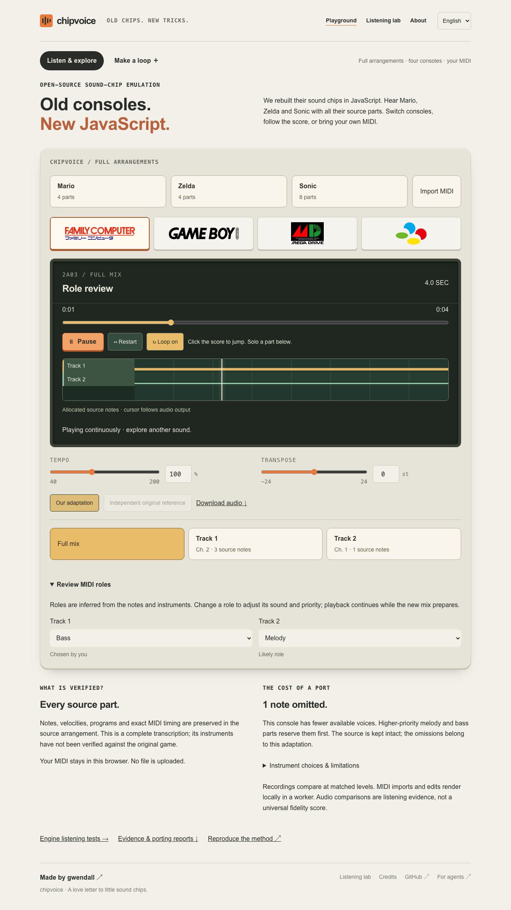
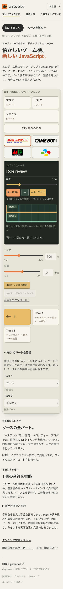

# Automatic mixing: cold-review corrections

<p align="center"><a href="AUTOMATIC-MIXING-COLD-REVIEW-2026-09-07.md">English</a> &bull; <a href="AUTOMATIC-MIXING-COLD-REVIEW-2026-09-07_ja.md">日本語</a></p>

## Scope and result

Version **0.16.2**, candidate `ffedd1c`. All **70 development** and **85 frozen validation** score/console pairs pass on complete performances. The latter is **17 scores on five consoles**, not 85 independent songs: twelve generated variants, four different structural families and Mario. The new families cover counterpoint, expression within long notes, program/tempo changes and sparse percussion with late harmony. Source, engine, policy and profile identities are recorded in [qualification.json](../../scores/mixing/qualification.json).

The cold review found defects despite the earlier six-second checks passing. These are now regression-tested through real public planning/driver paths:

- Eight low SNES notes split across parts previously caused **8,869 internal saturated additions** while final peak stayed at 0.449. Joint dry/echo budgeting prevents this in the reproduced cases, including staggered entrances, release and expression.
- Seven silent notes previously ducked an audible note by **8.999 dB**. Source-silent notes now reserve no voices and remain in `plan.silentNotes`; adding lower/earlier silent notes preserves the original audible PCM.
- PSG3/noise overlaps in Mega Drive phrases are rejected using the same resource model as full scores. Explicit FM percussion uses FM and retains its pitch under melodic transposition.
- MIDI track order no longer decides the melody in the regression fixture. Whole-note analysis provides confidence and explicit role overrides; channel-derived percussion can also be corrected without deleting source metadata.
- Oversized phrases reject before frame allocation. Recovery of SNES volume respects the shared budget between actual staggered register writes. Source and target calibration pitches remain distinct during transposition.

The conservative SNES headroom policy can make dense adaptations quieter. It reports below-step levels rather than pretending that hardware volume resolution is unlimited. Native replay bypasses this policy.

## Acceptance evidence

- Complete development/validation renders: repeatable PCM, finite and unclipped output, source ledger accounting and zero observed SNES voice-sum saturation.
- Five-console lead fixture: audible output and velocity/author-prominence contrast within declared bounds. These are musical control checks, not a timbre oracle.
- Off-grid 44.1 kHz lead calibration probes: maximum permitted amplitude error **3 dB**, enforced in CI. 48 kHz and equivalent-voice probes remain separately labelled sensitivity measurements.
- SDK unit/golden tests and an empty-project package test pass, including a real AudioWorklet. The chip cores and compact-score golden recordings remain unchanged.
- English/Japanese browser role editing retains measured audible output; desktop and mobile screenshots show no horizontal overflow. The full browser suite also checks import progress, Stop, transport alignment, A/B, recording and publication.
- All **12 site arrangements** regenerated and verified against the built engine and source ledgers. Mario/Famicom, Zelda/Famicom and Sonic/Mega Drive native files, plus their three independent references, have unchanged file hashes.

## Runtime cost

Interleaved warmed measurements on the same host, a two-second score and a separate single-note phrase. The machine is not a phone benchmark. All planning ratios remain below **2×** and render ratios below **1.25×**. New mixing decisions run during preparation, not in the audio callback.

| Chip | Plan ms | Plan / legacy | Render / legacy | Phrase ms |
|---|---:|---:|---:|---:|
| 2a03 | 0.653 | 1.40× | 0.95× | 0.028 |
| dmg | 0.396 | 1.67× | 0.79× | 0.019 |
| md | 0.804 | 1.54× | 1.04× | 0.049 |
| snes | 0.652 | 1.73× | 0.95× | 0.021 |
| c64 | 0.358 | 1.09× | 0.90× | 0.017 |

## Reproduction

```sh
pnpm --filter chipvoice build
pnpm --filter chipvoice test:unit
node scores/mixing/check-calibration.mjs
node scores/mixing/acceptance.mjs
node scores/mixing/validate-profiles.mjs
node scores/mixing/evaluate.mjs
node scores/mixing/freeze.mjs
node scores/mixing/evaluate.mjs --held-out
node scores/mixing/benchmark.mjs
node scores/mixing/ablate.mjs
node scores/arrangements/evaluate.mjs
node scores/arrangements/verify-publication.mjs
pnpm --filter chipvoice-web build
pnpm --filter chipvoice-web test
pnpm --filter chipvoice test:fresh
```

`node scores/mixing/listening.mjs` prepares fifteen blinded, level-controlled comparison pairs locally. No human preference observations were recorded. Physical-phone/Safari acceptance remains open. Independently prepared SNES phrases with outstanding release tails must share a preparation window before scheduling; the API cannot retroactively alter an earlier phrase.




