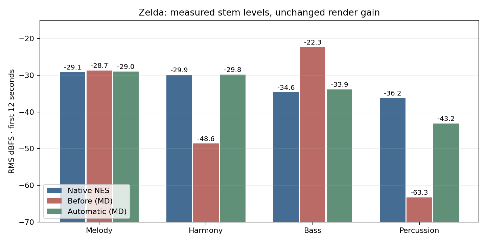
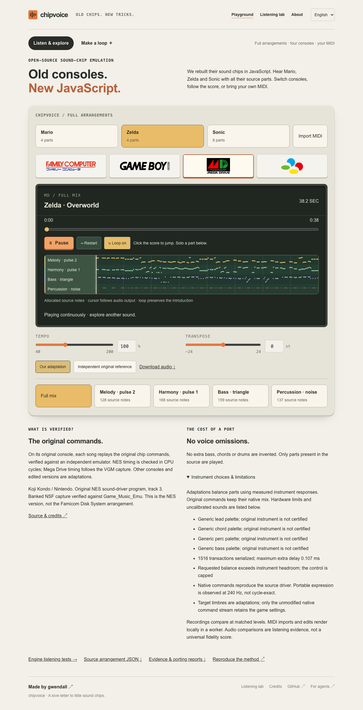
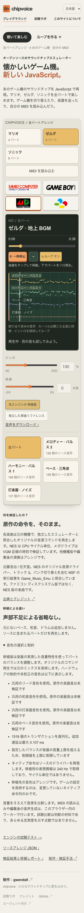

# Automatic mixing policy evaluation — 2026-09-07

<a href="AUTOMATIC-MIXING-POLICY-2026-09-07.md">English</a> &bull; <a href="AUTOMATIC-MIXING-POLICY-2026-09-07_ja.md">日本語</a>

## Development evidence

The fixed Zelda excerpt now puts bass 4.89 dB below melody on Mega Drive,
versus 5.50 dB below in native NES playback. Before the work, the Mega Drive
bass was 6.42 dB above melody. Harmony now measures −29.80 dBFS versus native
NES −29.90 dBFS. These stem comparisons use this SDK's native command replay,
not a claim of sample identity to an independent hardware recording.

The previous implementation selected PSG for an explicit FM harmony patch even
when an FM voice was free. Instrument compatibility now precedes role preference.
A regression failed before the fix and passes afterward. The noise stem remains
about 6.91 dB below the native NES stem: the target PSG's control reaches its
maximum. `mix-headroom` discloses the unachievable target; no per-song gain was
added to conceal it. The native Mega Drive output repair has
[separate independent-reference evidence](AUTOMATIC-MIXING-FOUNDATIONS-2026-09-07.md).

The initial development run covers 70 score/console pairs: generated lead-, bass-,
percussion-led and solo cases for three fixed seeds, plus Zelda and Sonic, on all
five SDK chips. Every pair has legacy-control and automatic renditions. Source
accounting passes, automatic PCM repeats exactly, and no invalid/final-clipped
samples or observed internal SNES sum saturation occur in the tested windows.
`development-evidence.json` records the results; full spectra/WAVs remain under
`.artifacts/automatic-mixing/development/`. This is not every possible input.

## Response and performance checks

Ninety factory sound/voice profiles use synthetic instrument probes, never fitted
song coefficients. Independent off-grid probes use pitches 54/78, duration 0.25 s
and velocity-derived controls 32/64/96/127. Maximum absolute RMS prediction errors
in that probe selection are 1.96 dB NES, 1.98 dB Game Boy, 0.40 dB Mega Drive,
0.68 dB SNES and 1.62 dB C64. At 48 kHz similar errors do not constitute factory
qualification for that rate. Equivalent NES pulse voices differ by less than
0.01 dB in the checked conditions; FM1/FM6 onset offsets differ by up to 0.25 dB.

A warmed, interleaved same-host benchmark measured automatic planning at
0.19–0.39 ms for the generated two-second fixture, versus 0.12–0.23 ms with
legacy controls in the same allocator. A single-note game phrase measured
0.006–0.021 ms. These isolate policy overhead on this host; they are not
representative phone, cold-start or historical-SDK measurements. Generated
factory JavaScript is about 190 kB, 37 kB gzip. No calibration runs in a worklet.

Tests additionally cover copied/frozen bounded custom caches, inverse responses,
future-note independence of gain, density smoothing, explicit foreground overrides,
source ownership, hardware silence and bounded game-phrase preparation. The
complete SDK unit suite passed, including the unchanged non-MD golden renders.

## Acceptance still in progress

Candidate `8ed23aa` was frozen with the full compiled SDK and evaluation inputs.
All 65 held-out score/console pairs pass, including Mario, with no tuning from
those results. Five additional local Musha Aleste MIDI ports pass on the final
engine; its 2,078 notes and seven source parts remain traceable. Twenty development
ablations compare legacy, calibrated-only and complete-policy controls with
identical voice allocation. `scores/mixing/qualification.json` records these
results and the exact frozen hashes. The measured maximum planning/render ratios
are 1.97/1.13 against the same-allocator control baseline, within the 2.0/1.25 budgets.

Browser tests pass for all four visible consoles, the real MIDI import, continuous
changes, Stop, Japanese copy and 320/390 px layouts. The MIDI has 1.875 s of
authored initial silence: its audio check now observes a phrase in audio time
instead of failing on a short wall-clock window. Screenshots and videos were
captured; the new explanatory diagnostics fit in the expanded mobile panel.
The packed SDK also passes public-API and real AudioWorklet browser tests in an
empty consumer. Deployment and actual registry verification are still pending.

 `scores/mixing/listening.mjs` prepares 15 blinded
RMS-matched listening pairs and exports local observations. No human preference
observations or real-phone/Safari measurements are claimed here. RMS, spectrum
and transient summaries are descriptive, not a universal musical-quality score.
