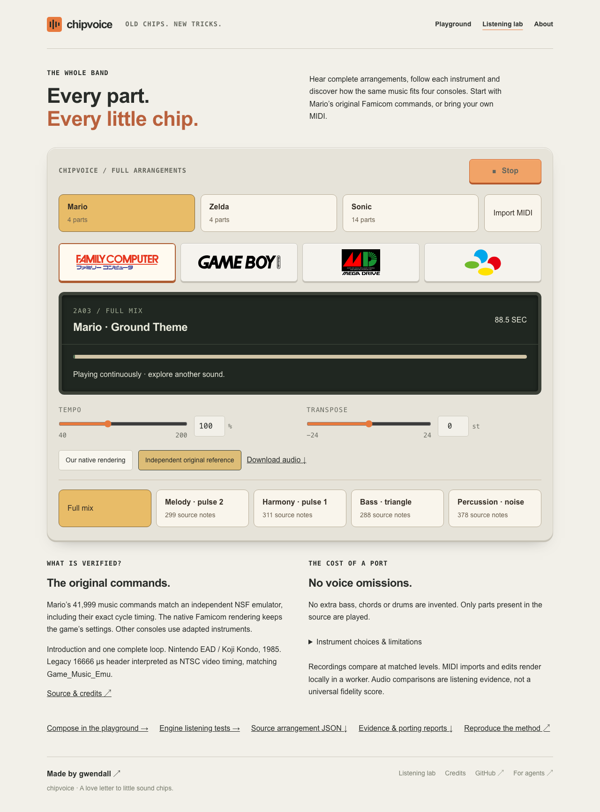
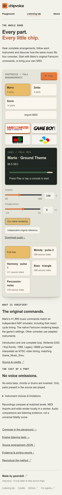

# Complete arrangements — 2026-09-06

  <a href="COMPLETE-ARRANGEMENTS-2026-09-06.md">English</a> &bull;
  <a href="COMPLETE-ARRANGEMENTS-2026-09-06_ja.md">日本語</a>

The reusable path is `importMidi → Performance → planPerformance → renderPerformance`.
It preserves independent source parts and exact ticks, then reports every omitted
note and instrument/hardware concession. It never composes missing accompaniment.
The public `/lab/arrangements` deck exposes complete mixes, isolated parts, local
MIDI imports, tempo/transpose controls and a native Mario A/B reference. Existing
tracker documents and publication endpoints keep their current format.

## Source evidence

| Source | Coverage | Independent evidence |
| --- | --- | --- |
| Mario Ground Theme | 4 voices, 1,276 extracted notes/hits, native introduction + entire repeated 5,184-frame cycle; 88.5375 s | All 41,999 music commands, addresses, values, order and absolute CPU cycles match pinned Game_Music_Emu execution |
| Zelda Overworld | Colletti MIDI, 4 parts, 592 notes; 38.9147 s | Independently extracted mido ledger: full form, parts, pitches, exact note boundaries, velocities, programs and tempo |
| Sonic Green Hill Zone | Turret 3471 MIDI, 14 parts, 2,367 notes, introduction and both main cycles; 91.45 s | Same independent full-part MIDI checks |

The native reference uses Game_Music_Emu revision
`fe8da4b6d3876d7542c2fb69d94487e19836d678`, with a logging-only patch. The checked
music-command digest is
`1a956e4e7a753a8383892108a82e4c70e7f3caf319b4934c641ab76e9661f67d`.
The exact NSF, independent PCM, raw trace and portable extraction have separate
frozen hashes. `compare-native.mjs` compares the two actual execution traces
without time shifting or warping; the capture checks the whole repeated loop.

Mario's 240 Hz portable envelope/timer extraction uses our own digital observer;
its reviewed checksum prevents accidental changes but is not an independent
oracle. The original Famicom version uses the untouched native commands. Other
consoles use adaptations. Zelda/Sonic are complete fan MIDI transcriptions,
**not certified original-game timbres**. A MIDI program is not a native patch.

## Allocation and audio evaluation

| Piece | Famicom omissions | Game Boy omissions | Mega Drive omissions | Super Famicom omissions |
| --- | ---: | ---: | ---: | ---: |
| Mario | 0 | 0 | 0 | 0 |
| Zelda | 2 | 2 | 0 | 0 |
| Sonic | 892 | 892 | 291 | 75 |

Priority-first interval allocation preserves melody/bass reservations. It does
not shorten or steal already allocated notes. Every source identity appears once
in either the plan or omission report. Soloing preserves the mix's allocation.
All eight SNES DSP voices are available for pitched parts; Mega Drive PSG3 remains
reserved for the noise clock. Hardware pitch limits and palette substitutions
are reported separately from voice omissions.

`pnpm arrangements:eval` renders the twelve full mixes sequentially, twice each,
with exact PCM equality, finite/unclipped output and SNES internal dry/echo-add
headroom checks. `verify-publication.mjs` binds the deployed FLAC bytes to those
WAVs, checks full decoded duration and rejects stale engine/source/evaluation
identity or an incomplete matrix. These checks qualify the published recordings;
they do not produce a universal fidelity percentage. The existing conformance
suite continues to qualify the cores independently.

## Browser evaluation

`apps/web/test-arrangements.mjs` records screenshots and video under
`.artifacts/arrangements/browser/`. It exercises first-interaction lazy audio,
native/reference A/B output, native part isolation, continuous selection of all
four consoles, all fourteen Sonic parts, local polyphonic MIDI, persistent invalid
import feedback, tempo/transpose changes and Stop during pending rendering.
Viewport checks cover 320, 390 and 768 px, with no horizontal overflow or text below
14 px. `test-buffer-playback.mjs` measures audible output through slow, failed and
cancelled selections, latest-selection precedence, Stop and bounded overlap.

Interactive playback applies a 3 ms seam taper to decoded buffers; exported
recordings and independent reference PCM remain unchanged. Introductory material
plays once before the native loop start. A/B uses a shared clock and attenuation-
only RMS matching. Full render jobs and MIDI parsing run in replaceable workers;
current audio continues while a replacement is prepared.

## Standards review

The code-review skill's standards agent found no documented-standard violation.
It identified three substantial design/correctness issues: independently sorted
bus bytes could corrupt a selector/data pair; MIDI controller fan-out could exceed
reasonable memory despite a bounded file; and a pending decode could commit while
its replacement worker was still preparing. These were corrected with atomic bus
transactions, a pre-expansion 200,000-expression-point budget and synchronous
selection cancellation. Follow-up found transient import errors disappearing;
those now have independent state, with a browser regression.

## Spec review

The separate spec agent independently found the bus transaction error, an
artificial seven-pitched-voice SNES limit, stale audio selection, missing protection
for Mario's portable extraction and insufficient binding of reference PCM to its
source. These were corrected, with real-arrangement register-destination checks,
eight-voice regression, mutation tests, a pinned manifest and direct trace
comparison. The final import follow-up also guards ownership before terminating a
worker, so an older rejected file read cannot kill a newer import.

## Reproduce and extend

See [the workflow](../../scores/arrangements/README.md) for import, independent
ledger extraction, native capture, exact trace comparison and publication commands.
SDK unit tests cover malformed MIDI, running status, sustain, overlapping notes,
controller/bend/tempo changes, deterministic allocation and explicit losses.
Mutation tests reject missing or invented source notes/parts and altered musical
or native command data. Synthetic bus-collision tests cover shared FM frequency
latches; real complete arrangements compare intended versus actual destinations.

Do not use this host's render wall times as a performance benchmark: it was
heavily loaded. Full arrangements currently use a dedicated deck and JSON/SDK
workflow. Native Zelda/Sonic patch validation, additional MIDI expression adapters
and integration into the compact tracker publication format remain separate work.

## Qualified result

All twelve full mixes passed byte-exact repeatability, finite/unclipped PCM and
internal SNES headroom checks. Publication verification, source/transaction
regressions, MIDI/allocator unit tests, repository typechecking, arrangement browser
flows and common buffered-transport regressions passed locally. The browser audio
probe measured RMS around 0.091 during delayed and failed loads, zero after Stop,
and at most four overlapping buffer sources. Both review axes finished with no
remaining substantial findings after the fixes above.

The native command digest and full snapshot metadata are also available in the
[public report](../../apps/web/public/arrangement-data/report.json).
Browser audibility checks span a phrase window: the source contains intentional
rests, so a single silent analyser frame must not be treated as a broken voice.

