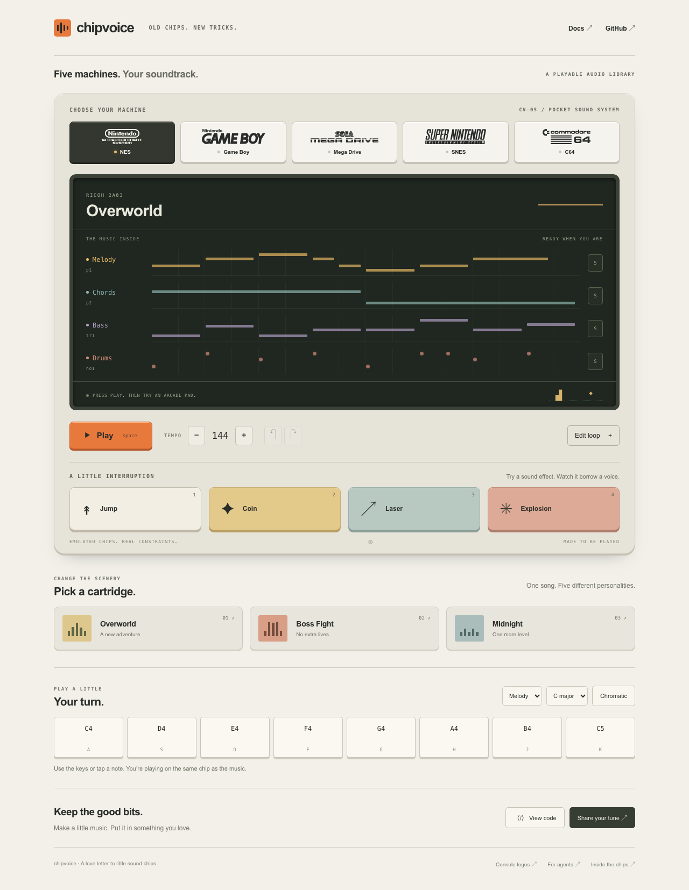
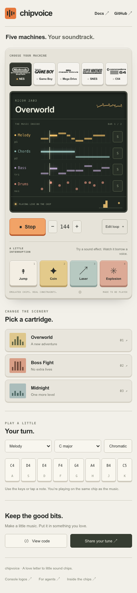

# 遊べるデモV1評価 — 2026-09-05

  <a href="DEMO-2026-09-05.md">English</a> &bull;
  <a href="DEMO-2026-09-05_ja.md">日本語</a>

remote main `d7ed0b8`からの`feat/playable-demo`、1 PRで実装。この評価時点では未マージ／未配備です。範囲は[DEMO.md](../DEMO_ja.md)のA〜C。ライブ録音、変奏、MIDI、ステムは後続です。

CIで発見したcapture log予約回帰と設計修正は[翌日の後続](SCHEDULING-2026-09-06_ja.md)にあり、ミキサー、package、Chromiumの結果を補います。

## 変更内容

5機種、3曲、4役割レーン、4効果音、ミュート／ソロ、音符／ドラム編集、音色、試聴キー、Undo／Redo、下書き復元を持つコンソールにしました。共有は全パターン、順序、和音形、意図、機種を保持し、公開と下書きリンクを区別します。コードパネルは実行例とworkerのステレオWAVを提供します。

この段階の機種画像はHVR88のMonochrome Gaming Logos由来のローカルSVGです。出典は`apps/web/public/machines/README.md`とフッターに記録。先に調査したmulti-tapはScreenScraper proxyを使っていました。

## 視覚確認

本番ビルドのデスクトップと390×844タッチ模擬画像を確認しました。携帯初画面に5機種、Play、4パッドが見えます。編集は16対象を縮めず横スクロールし、試聴オクターブ外の既存音も表示します。デスクトップ動画の1フレームでは、C64でSFXが共有第3ボイスを借りる際、和音とドラム両方を正しく示しました。

編集／効果音画像、報告、WAV、WebMは`.artifacts/demo/`へ生成し、CIの`demo-evaluation`へアップロードします。恒久的な本番メディア保存先ではありません。

## 機能と音声の検査

- `pnpm build`、`pnpm typecheck`、全package単体成功。
- 一時SQLiteの本番APIで検証、公開／fork、決定的render、ID3、共有metadataを確認。
- Chromium／Firefox／Playwright WebKitのdesktop／touch模擬成功。明示開始、5機種実音、切り替え／Stop、SFX所有、keyboard編集、Undo／Redo、不完全text、下書き、全draft-link往復、公開再読込／title fork、worker stereo、別ページでlocal packageからbuildしたJavaScript実例を検査。
- Chromiumではnative touch scrollで楽譜不変を確認。
- WAVは同じ機種／stereoの`toWav(renderSong(arrange(score)))`とバイト一致。PCM16、44.1 kHz、2ch、6.667秒。
- 5参照コーパスが基準成功。MD／SNES／C64は信頼対象出力で一致。NES／GBは記載済み差を維持し、実機一致とは称しない。
- 存在しない適合性baselineはコーパス前にexit 1。

Chromiumで異なる曲位置の短区間を測った値です。**音量比較でも性能基準でもありません。**

| 機種 | RMS | ピーク |
| --- | ---: | ---: |
| NES | 0.0906 | 0.5732 |
| Game Boy | 0.1486 | 0.7167 |
| Mega Drive | 0.1306 | 0.3502 |
| SNES | 0.0567 | 0.5427 |
| C64 | 0.1411 | 0.7047 |

予約音の先まで待ってもStopピークは0.001未満。`window.chipvoiceMetrics`はセッション内の操作と最初の非ゼロ音だけを記録し、個人情報／楽譜／analytics要求を送信しません。

## 評価中に見つけて修正した不具合

両軸レビューで6件を発見しました。公開draft復元損失、高音非表示、楽譜置換時の古い位置、古い非同期chip生成、patch／sample初期化のキャンセル、曲による遅延SFXの無音化です。再確認では遅延SFX置換による直前区間消失と、cutを越えたseek後の和音shapeずれを追加発見。すべて修正し、transport／browser回帰で確認しました。競合する不変cache決定も明示的に更新しました。

transportはレジスタとrender sampleを観測し、Stop、重複／遅延SFX、持続音復帰、キャンセル後初音を検査します。全5コアで128／4096 host block出力一致。MD／SNESの消費済みwrite再生を発見し、修正で両ゴールデンを意図的に更新しました。raw corpus一致は不変、NES／GB／C64ゴールデンも不変。理由は決定22です。

SNES encoder再構築のたびに固定BRRバンクを再コンパイルする経路も除きました。1回だけ生成し、memory境界でコピーします。数値的速度改善は主張しません。

## 明示的な後続

利用者のホストは混雑しており、browser時間、初音時間、短い状態の取り逃しを応答性の基準にしません。最終検査は直列化しました。300 ms効果音中にrunnerが戻ると仮定せず、mutation observerで一時的所有状態を記録します。

実Safari／携帯のaudio unlock、中断、scroll／pinch、reduced motionは未確認です。WebKitは実iPhoneではありません。人の利用観察と比較遅延／CPUは代表端末待ちです。PR準備は妨げませんが、この時点で利用者はマージしないよう指示していました。

NES／GB ROMとミキサーはCIに残ります。ローカル全検査は5コーパス終了後に負荷軽減のため中止したので、この評価ではROM／ミキサー成功を主張しません。認証ID、render cache、音高診断、versioned migrationは別監査残件です。

CIは古いPR revisionをキャンセルしNext cacheを再利用、Webとsilicon／ROMを独立実行します。remote Chipvoice mainを取得して変更なしでした。このrepoにDaemon／MoshiのCI変更はなく、他project再利用を主張しません。
