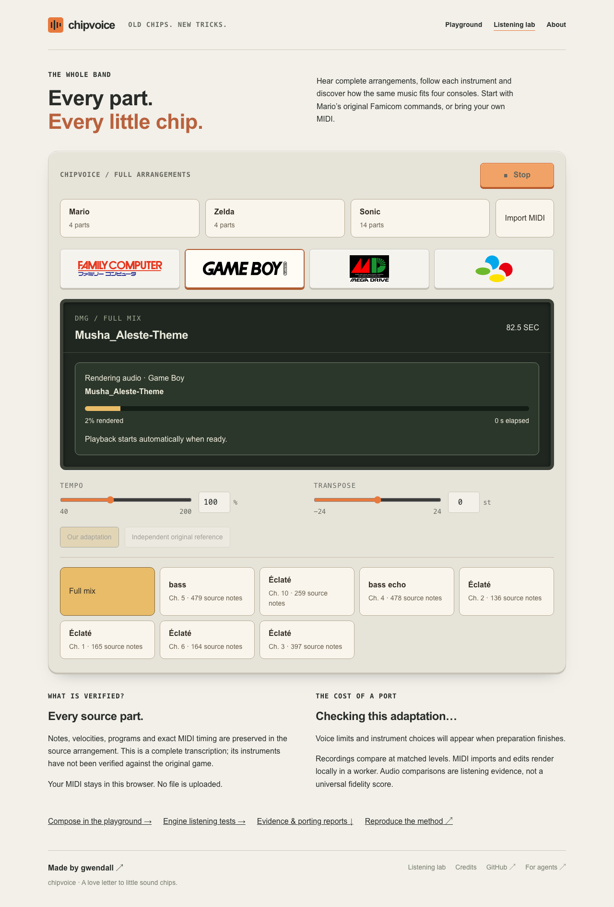
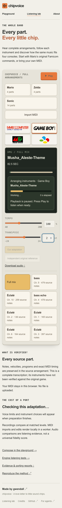

# MIDI import feedback — 2026-09-06

The reported import was successful but silently spent time rendering the entire
82.5-second arrangement before playback could begin. The screen displayed the
imported title and Stop intent during that wait. A separate text decoding error
rendered the source's `Éclaté` track names as `�clat�`.

## Reproduction and test gap

The local `Musha_Aleste-Theme.mid` contains 25,427 bytes, seven source parts and
2,078 notes. The browser reproduction accepted the file immediately, showed the
new title, but measured only silence while its worker was still rendering. The
new long-import E2E failed on the deployed version because no named preparation
indicator existed. The text regression separately failed with `�clat� !== Éclaté`.

The earlier browser test imported a two-second, three-note fixture and waited for
a heading. That did not cover a long real render. The new test waits for progress,
actual render/decode completion and an audio download, then measures sound. It
runs from a fresh page without another Play click. CI uses a generated 82.5-second
MIDI; the optional `MIDI_FILE` input exercises a local file without committing it.

## Fix

- UTF-8 is decoded strictly; invalid UTF-8 falls back to Windows-1252 with a notice.
  The original label is preserved. `Éclaté` is source metadata, not an instrument
  name; channel numbers distinguish identically named parts.
- The SDK reports completed frame fractions after offline rendering blocks.
  Tests verify monotonic progress and unchanged PCM with/without the callback.
- The worker sends planning/rendering/encoding stages, capped to one message per
  integer percent. The UI shows filename, target console, stage, real percentage,
  elapsed time and Play intent. Stale progress cannot update a newer selection.
- The display avoids `0.0 SEC` before duration is known and avoids presenting a
  provisional omission count as a completed adaptation result.
- Stop remains authoritative while rendering finishes. Existing audio continues
  while a replacement is prepared.

## Real-file browser results

The complete local file passed on all four consoles with decoded `Éclaté` labels,
visible preparation, audible output after completion, no browser errors, and Stop
remaining silent after an in-flight render completed.

| Console | Maximum browser RMS in the listening window |
| --- | ---: |
| Famicom | 0.0503 |
| Game Boy | 0.1402 |
| Mega Drive | 0.1227 |
| Super Famicom | 0.0642 |

These are functional audio measurements, not timbre-fidelity or performance scores.
The host was busy; render wall times are not a benchmark. The existing twelve-mix
publication evaluation also qualifies the updated SDK and checks its recordings
against the previous snapshot.

Reproduce using [the workflow](../../scores/arrangements/README.md#long-midi-import-regression).
Screenshots, videos and JSON results live under `.artifacts/midi-import/e2e/`;
CI retains them alongside the other browser evaluations.

## Review

Both code-review axes found no remaining substantial production defects. Review
caught two issues in the configurable E2E harness: switching the initial console
could cancel the importer, and an external file was incorrectly required to use
the synthetic fixture's specific track name. Initial console selection now happens
before upload; fixture-specific names are asserted only for generated input. The
Game Boy-first real-file path and the existing arrangement browser suite passed
on the final build.

Final qualification: all twelve complete mixes remain byte-identical to 0.15.0
in both WAV and FLAC form. Full PCM repeatability, finite/unclipped output, SNES
internal headroom, source/transaction checks and publication identity passed.
The generated long-MIDI E2E also passed locally before entering regular CI.
