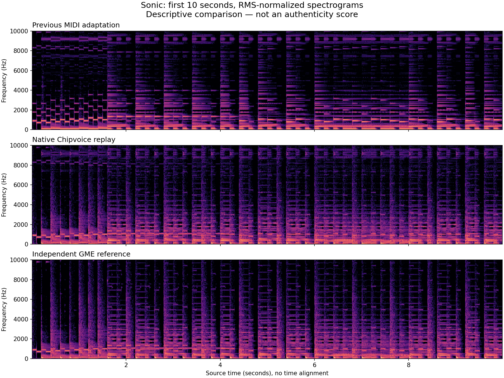

# Native song fidelity — 2026-09-07

<p align="center">
  <a href="NATIVE-SONGS-2026-09-07.md">English</a> &bull;
  <a href="NATIVE-SONGS-2026-09-07_ja.md">日本語</a>
</p>

## Finding

The user was right about Sonic. The previous Mega Drive adaptation substituted
GM-family instruments and omitted 291 source MIDI notes. The original VGM has
448,596 DAC sample writes; that adaptation had none. Zelda was also a MIDI
transcription, so its matching MIDI ledger did not verify the game's instruments.

The solution is native command playback on the original machine, with portable
observation kept separate for editing and other-console arrangements. Selecting a
song selects its original console; Mario, Zelda and Sonic all have independent A/B.

## Evidence

| Song | Original version | Native comparison |
| --- | --- | --- |
| Mario | NTSC Famicom/NES | 41,999 commands, addresses/bytes/order and absolute CPU cycles unchanged |
| Zelda | NTSC NES, NSF track 2 | 28,306 commands match independent GME execution; bank switching supported; complete 1,920-frame repeated cycle verified |
| Sonic | NTSC Mega Drive, Green Hill Zone VGM | 458,039 expanded FM/PSG/DAC commands match independent GME decoding at their original VGM sample timestamps |

Zelda is 63.2625 seconds including its first pass and repeated cycle. Sonic is
53.1993 seconds with a loop at 14.7993 seconds. Zelda is the NES arrangement,
not the Famicom Disk System version with its additional hardware.

For Sonic, native Nuked-OPN2 receives an independent reconstruction of the bus
from GME's decoded VGM trace. Six FM channel values and both DAC pins are hashed
after every internal clock: **68,010,485 clocks**, 1,088,167,760 bytes. Both
implementations produce SHA-256
`cf257205e4336af9751be4c0b46c2ca76c73a319dd7c3aa56d42eabd30916cb2`.
This is the documented FM bus policy and digital outputs, not analog PCM parity.

## A necessary integration regression

The first native adapter exposed a second error. VGM can timestamp many logical
register writes at the same sample. Feeding their address/data bytes on adjacent
YM clocks lost pending settings: a requested operator multiplier remained at its
power-on value. An independent core given that same invalid serialization also
agreed, which demonstrates why a digital digest alone is insufficient.

The corrected adapter uses Nuked's buffered-write policy: 15 internal clocks
between FM port bytes. A regression asserts actual multiplier, envelope and
frequency state in the running core, not merely the presence of bytes in a log.
Native logical timestamps remain unchanged in the source audit; physical bus
serialization is explicit. Sonic's maximum address delay is 353,430 master cycles
(6.5824 ms). This is not a recovery of original CPU timing from a VGM.

Inputs whose final FM byte cannot be consumed before the captured duration are
rejected. Native solo retains shared latches and the PSG tone-3 noise clock;
unselected FM3 also has its timer-triggered CSM key-on masked. Tests inspect
actual DAC data delivery and actual CSM state, including a selected FM3.



These are the first ten seconds, RMS-normalized, with no time shifting. The
spectrogram helped detect the lost FM settings. It is descriptive evidence of
musical structure and timbre, not a universal authenticity percentage.

## Reproduce

See [the source method](../../scores/arrangements/README.md) for downloading the
credited source, pinned emulator builds and capture commands. Frozen references
bind source files, the initialization recipe, portable extraction, logical
commands, physical bus events and independent PCM separately.

```sh
pnpm --filter chipvoice build
node scores/test-capture-nsf.mjs
node packages/chipvoice/test/vgm-import.mjs
pnpm arrangements:check
node scores/arrangements/verify-native-songs.mjs
node scores/arrangements/verify-ym-native.mjs
pnpm arrangements:eval
node scores/arrangements/verify-publication.mjs
SITE=http://127.0.0.1:3074 node apps/web/test-native-songs.mjs
```

Full recordings are rendered twice and published losslessly. Browser tests
measure native/reference output, original DAC solo, first-selection hardware,
loading completion and mobile overflow, with screenshots and video in
`.artifacts/native-songs/browser/`. Host durations are not performance benchmarks:
the user's machine is heavily loaded.

## Completed checks

The twelve complete mixes pass repeat-render equality, finite/unclipped PCM,
source/engine/reference fingerprints and lossless FLAC duration checks. All
three Super Famicom adaptations have zero internal mixer clamps. SDK unit tests,
the production web build and the 631-key English/Japanese audit pass.

The production browser run measured these short output windows. They establish
audibility, not a timbre score or a level comparison at identical song positions.

| Song | Chipvoice RMS | Independent-reference RMS |
| --- | --- | --- |
| Mario | 0.02798 | 0.01362 |
| Zelda | 0.03180 | 0.02609 |
| Sonic | 0.05206 | 0.03615 |

Original Sonic DAC solo rendered in the worker and measured RMS 0.04953.
All three cartridges select their original hardware, and full-reference A/B is
disabled for a solo. Mobile widths 320/390/768 and Japanese 390/1280 have no
horizontal overflow; no uncaught page error was recorded. The transport scenario
also passes seek, pause, restart, end, loop and continuous console/tempo changes;
its largest observed visual-to-audible-clock difference was 12.39 ms. This is one
browser run, not a universal latency bound.

Inspected screenshots: [Sonic desktop](native-sonic-desktop.png),
[Japanese mobile](native-sonic-mobile-ja.png). The spectrogram's native excerpt
also matches the first ten seconds of the final FLAC sample for sample.

## Limits

GME uses its own filters and resampler; matching native commands or digital pins
does not make the final PCM bit-identical, nor establish measured physical
console fidelity. PSG accuracy and analog balance keep their conformance limits.
The Sonic plot still shows additional high-frequency energy in Chipvoice,
especially near 8–10 kHz. The output stage currently averages multiplexed DAC
pins over each output sample; distinguish resampling images, filtering and PSG
balance with isolated reference captures before claiming final-output parity.
The plot alone does not identify the cause of this residual difference.
Other-console renditions and tempo/transpose edits use observed musical data.
Their FM envelopes, stereo, release tails and DAC drum identities are incomplete;
portable DAC bursts use a generic percussion mapping. The original samples are
preserved in native Mega Drive playback and native solo.
