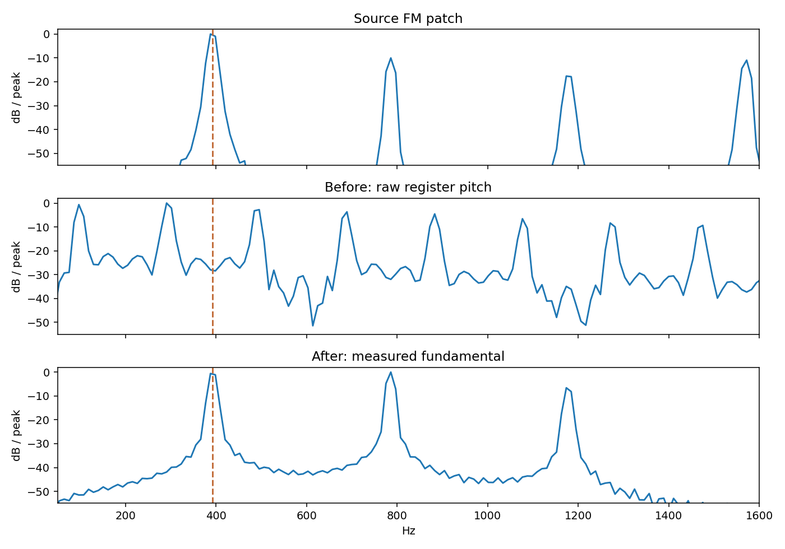
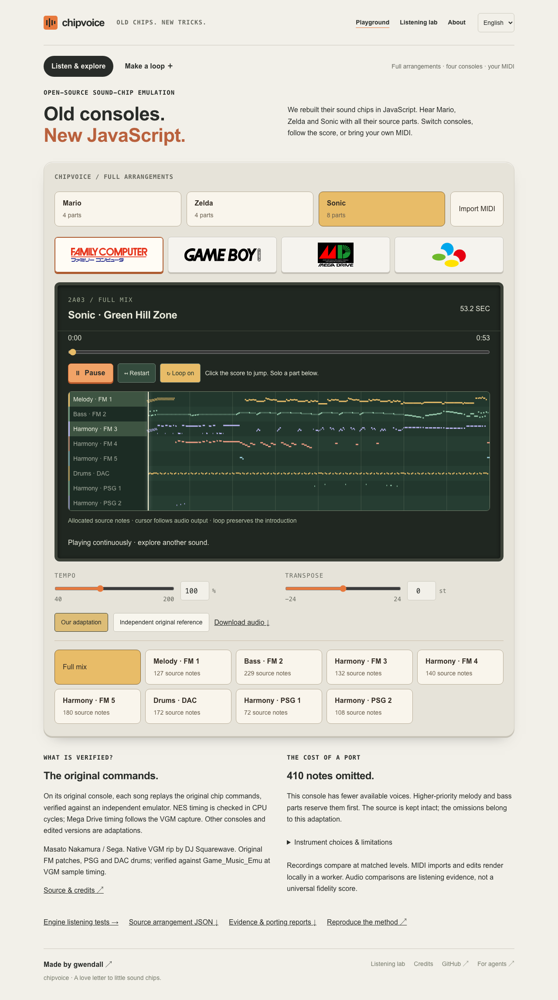
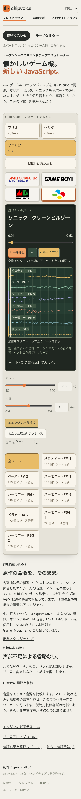

# Portable timbres and dry SNES — 0.16.3

The reported problems were audible arrangement defects that the previous
finite/unclipped/deterministic gates did not detect. This follow-up fixes their
measurable causes. It does not turn those gates into a universal musical judge.

## Reproduced failures

- A short SNES lead probe had echo energy only **9.84 dB below its direct sound**;
  the late tail was −28.30 dB relative to the held note. Factory space was imposed
  even when no composition requested it.
- A Sonic FM harmony probe produced a fundamental near **392 Hz** on the source
  chip, while the port used the raw register base near **98 Hz**: two octaves low.
- Renumbering an otherwise identical native FM patch changed NES, Game Boy and
  SNES output. Local patch IDs were being interpreted as General MIDI programs.
- The DAC observer merged adjacent attacks and assigned every burst to a kick.
  It also lacked DAC-enable filtering and an initial boundary without a seek.

These spectra are normalized separately for shape comparison. They demonstrate
pitch correction, not timbre equivalence or equal perceived loudness.

## Corrections

The SNES factory driver is dry. Its automatic shared voice budget is now 120/128
for the dry sum, with the existing release/stagger safeguards. Native raw echo
register streams retain the full DSP behavior. All 90 factory response profiles
were regenerated; the SNES compact-score golden changed deliberately to remove
its echo, while the other chip goldens stayed identical.

Native FM preparation now measures distinct patches at 220 and 440 Hz, detects a
stable harmonic period, samples the amplitude envelope and assigns a coarse
portable family. `portableTimbres` carries that bounded result into the planner;
no rendering or analysis enters live playback. Source signatures reject stale
descriptors. Pulse ports favor a clear fundamental over narrow decorative pulses.
The score projection displays the measured fundamental too.

For Sonic, 25 measured patch descriptors cover 808 FM note intervals. Measured
offsets are −12 semitones for 229 intervals, +12 for 181, +24 for 291 and zero for
107. These are waveform-period projections, not claims about intended GM labels.

The DAC preparation uses seek boundaries plus repeated 32-byte PCM attacks to
split concatenated samples. It observes DAC activation, ignores redundant enable
writes, preserves initial streams without seeks, and distinguishes tonal/noisy
drum families. Sonic now has **96 kick and 76 snare attacks**, replacing 141
unclassified bursts. Quiet candidates below a declared 4/128 RMS activity floor
are recorded separately. No percussion pattern is composed or filled in.

## Validation

- Real PCM regression: measured source fundamental reaches the NES, Game Boy and
  SNES outputs. Patch renumbering is invariant; stale descriptors fail.
- Synthetic DAC cases: concatenation, absent seeks, disabled DAC, redundant
  enable and disable/re-enable boundaries.
- **70 complete development score/console pairs**, source accounting, repeatable
  PCM, finite samples and internal SNES saturation checks.
- **12 complete site arrangements** and three independent reference assets;
  native Mario, Zelda and Sonic recordings remain byte-identical.
- **Six fresh SNES listening-lab cases**, complete loops and stems, each matching
  the independent native S-DSP oracle. The other 24 lab cases retain their
  existing evidence: their compact renderer and chip cores are byte-identical.
  Per-row provenance records which cases were rerendered or carried forward.
- SDK unit/golden suite, calibration provenance, five-console acoustic gates,
  off-grid profile validation, an empty consumer install and full web suite.
- Targeted browser checks verify each Sonic port's actual asset hash, audible
  output and continuous console switching, with desktop/Japanese mobile captures.

The API and preparation workflow are documented in [English](../MIXING-API.md)
and [Japanese](../MIXING-API_ja.md). Raw qualification, spectra and seven aligned
before/after listening comparisons live in `.artifacts/timbre-review/`; delivery
artifacts are attached to the release. Listening comparisons use fixed gains to
match RMS, without dynamic compression. Their preparation is not a human vote.

## Independent review

**Standards:** two concrete DAC boundary/state findings, corrected with synthetic
regressions. No additional documented-standard or hot-path regression found.

**Spec:** the same two DAC findings, plus verification of idempotent enable
handling. Follow-up confirmed the fixes and the real-PCM projection tests. No
further concrete defect was identified within the declared analysis limits.

## Remaining limits

The analyzer covers harmonic patches at two test pitches and a 0.8-second
amplitude window. Inharmonic FM, key scaling, later envelope evolution, exact
release tails, stereo and original sample banks need richer models. A low-confidence
measurement does not establish a musical pitch. Target timbres are approximations;
NES/Game Boy still omit 410 lower-priority Sonic notes because of voice limits.

Controlled human listening and physical mobile-device checks remain separate.
The earlier 0.16.2 held-out qualification is historical; this evaluation does not
relabel it as a new unseen timbre benchmark.

