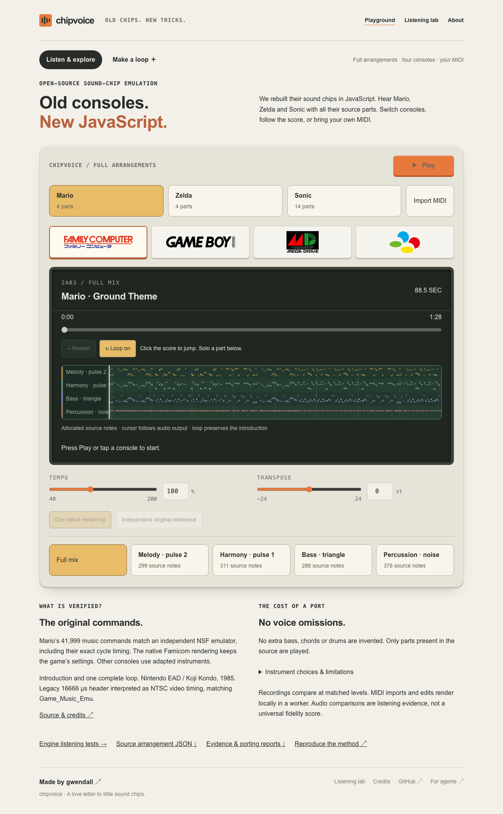
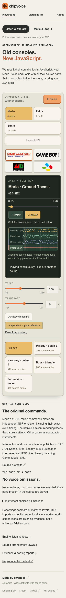

# Unified playground evaluation — 2026-09-06

Specification: [one playground and musical transport](../UNIFIED-PLAYGROUND.md).
Base: `606242c` (PR #33). SDK remains 0.15.1; no DSP or reference recording changed.

## UI review

| Before | After | Why |
| --- | --- | --- |
| Home plays a melody; a banner points to a third surface | Complete Mario, Zelda and Sonic arrangements on `/`; old arrangement URL redirects | Full accompaniment is immediately discoverable |
| Static loading message before the deck | Server-rendered catalogue and initial four-part score | No full evidence download needed to see what the library does |
| Stop/restart and a passive progress bar | Pause, restart, accessible seek, score click, elapsed/total and loop toggle | Navigate and compare full compositions |
| Cursor uses render time | Cursor and selected score use output-device timing | Do not lead delayed audio or show the next score prematurely |
| Editor competes with listening surfaces | Make a loop in the same playground, with exclusive audio ownership | Keep drafts, recording, pads, code and sharing accessible |

The existing paper/console palette, Japanese colour marks and shared typography
are retained. Static note canvases avoid thousands of animated DOM nodes. The
cursor has no easing; part activity changes directly. Reduced motion disables
press scaling and indeterminate progress movement.

## Automated evidence

- Production web build and TypeScript; complete SDK unit suite.
- `test-output-clock.mjs`: output timestamp extrapolation, latency fallback,
  clock bounds, source-time projection through a tempo map.
- `test-buffer-playback.mjs`: measured sine output during delayed and failed
  loads, latest selection/cancellation, pause during loading, bounded overlap
  (maximum four BufferSources), paused seek, resume, frozen position, natural
  end/replay and rapid seeks/pause/resume. Added regressions for disabling Loop
  after a traversal, Pause after the source ended but before its sound reached
  the device, and retaining old score metadata until the new source is audible.
- `test-transport-browser.mjs`: full-mix first load, no eager FLAC/full report,
  keyboard and score seek, pause/restart/end, native introduction on loop,
  musical phase through console/tempo swaps, A/B choice across composer handoff,
  exclusive audio, desktop/mobile screenshots and video. Compares the DOM cursor
  with independently observed BufferSource start/offset and output timestamps.
- Existing arrangement, MIDI import, listening lab, real-time transitions,
  editor/recording, publication, auth/API and shared-draft browser checks remain
  in the web qualification. Composer checks explicitly enter `/?mode=compose`.

The initial instrumented browser run reported 173–176 ms of output delay.
Steady playback and post-operation cursor error measured 0.8–15.7 ms across seven
checks (one display frame). This is browser-clock evidence, not a microphone
measurement of physical speakers. Subsequent runs write fresh measurements to
`.artifacts/unified-playground/result.json`; CI retains screenshots and video.

## Real desktop MIDI

Imported the user's `Musha_Aleste-Theme.mid` through the browser file input:
82.5 seconds, seven source parts, 2,078 notes. Full local rendering and non-zero
output were verified on every public console. No source MIDI is committed or
uploaded to the server. Legacy `Éclaté` track names remain intact.

| Console | Maximum RMS observed in the phrase window |
| --- | ---: |
| Famicom | 0.06250 |
| Game Boy | 0.11405 |
| Mega Drive | 0.12806 |
| Super Famicom | 0.06299 |

These levels prove audible output, not equal timbres or original-game fidelity.
Render elapsed times on this busy host are not performance benchmarks. The file
acknowledgement, target console, stages and real rendering percentage remain
visible during slow preparation. Full evidence is local at
`.artifacts/unified-playground/real-midi-result.json` and the MIDI E2E artifacts.

## Two-axis review

Standards review: found the ended-source/Pause resource deadlock and the later
A/B state mismatch across modes. Both corrected with regressions. Final bounded
follow-up: no remaining substantial findings.

Spec review: found loop-disable phase rebasing, ended/Pause deadlock, early score
presentation, requested-versus-active composer tempo, and A/B state reconciliation.
Each corrected; final bounded follow-up: no remaining substantial findings.

The presentation is now attached to the same bounded timing history as the audio;
new preparation/cancellation cannot lose a selection already being heard. A/B
controls stay pending until that presentation reaches the device. The composer
reads timing from its active engine, while the requested next score prepares.

## Final local qualification

Production build, TypeScript, SDK units and all web qualification scripts passed.
After adapting the legacy composer tests, the runner resumed the remaining
scripts against a fresh disposable API database; CI still runs the entire suite.
`CHIPVOICE_TEST_FROM=<script>` permits this bounded local resumption without
repeating already-passing API/audio work. The Playwright browser cache disappeared
during the run and was reinstalled before continuing.

The final instrumented transport run measured 4.0–17.0 ms cursor error. Musical
phase error at the exact console and tempo transition starts was zero. The tests
also passed the synthetic delayed-output/end/Pause window, old/new presentation
handoff and A/B reference selection after returning from the composer.

Linux CI exposed a test assumption about output latency: after a fixed 450 ms
wait, the same correct seek had advanced farther than on macOS. The regression
now asserts the exact committed seek/resume offset instead of a platform-specific
phase interval. The separate instrumented E2E still measures the audible cursor.

A subsequent Linux CI run exposed a real exact-end edge case: a deferred audio
replacement started at `offset === duration`, with looping disabled. The audio
clock advanced and the score reached the end, but Chromium emitted no `ended`
event, leaving the transport playing. Completion now follows the output-clock
deadline directly; `ended` remains a resource signal, not the only way to finish.
The timer sleeps until that deadline instead of polling throughout the song.
A browser regression suppresses the event and proves completion; a second covers
an immediate restart queued behind an exact-end seek with low output latency.
A third proves Pause/resume before the audible deadline releases a known empty
source without waiting for its missing event. All three failed before their fixes.

The full transport E2E also passed in a local Linux Chromium container, including
composer handoff, screenshots and video. Its observed output delay was about
30–37 ms (different from the macOS device), with cursor error of 1.6–44.0 ms on
this busy host. CI failure artifacts now retain the source offset, ended flag,
context state, output timestamp, screenshot and finalized video.
