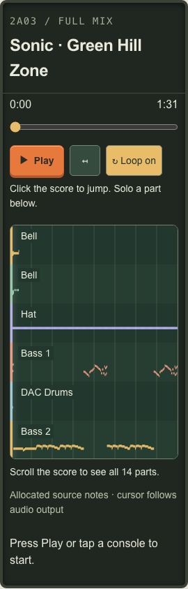

# 統合プレイグラウンド評価 — 2026-09-06

  <a href="UNIFIED-PLAYGROUND-2026-09-06.md">English</a> &bull;
  <a href="UNIFIED-PLAYGROUND-2026-09-06_ja.md">日本語</a>

仕様は[単一プレイグラウンドと再生操作](../UNIFIED-PLAYGROUND_ja.md)。基準`606242c`（PR #33）。SDKは0.15.1のままで、DSPと参照録音は変更していません。

## UIレビュー

| 変更前 | 変更後 | 理由 |
| --- | --- | --- |
| ホームは単旋律、bannerで第3画面へ | `/`でマリオ／ゼルダ／ソニック完全編曲、旧URLは転送 | 伴奏を即座に見つけられる |
| deck前の固定loading文 | server描画catalogueと初期4パート楽譜 | 全証拠の取得前に目的が分かる |
| 曲／機種選択より上のPlay | progress下の先頭にPlay／Pause、横にRestart／Loop | 制御対象の位置の近くへ配置 |
| Stop／restartと受動progress | pause、restart、accessible seek、楽譜click、経過／全長、loop | 全曲を移動し比較可能 |
| 携帯で狭い名前列が切れる | 音符の上に全幅名、余白削減、縦scroll制限 | 文字を縮めず読める |
| render時刻のcursor | 出力装置時刻のcursorと楽譜 | 遅い音より先行せず、次の楽譜を早く出さない |
| 編集が試聴画面と競合 | 同じ画面にMake a loop、音源所有は排他 | 下書き、録音、pad、code、共有を保持 |

紙／コンソールの配色、日本版の色付きロゴ、共通文字を保持します。静的note canvasで多数の動的DOMを避け、cursorにeasingを付けずactivityを直接更新します。reduced motionは押下scaleと不定progressの動きを無効にします。

## 自動化された証拠

- Web本番build、TypeScript、SDK全単体。
- `test-output-clock.mjs`：output timestamp外挿、latency fallback、時計境界、tempo mapを通すsource time投影。
- `test-buffer-playback.mjs`：遅延／失敗中の実正弦波、最新選択／cancel、loading中pause、最大4 BufferSources、停止中seek／resume、凍結位置、自然終了／replay、連続seek／pause／resume。周回後loop無効化、source終了後まだ音が装置へ届かない間のPause、新sourceが聞こえるまで旧楽譜metadata保持の回帰も追加。
- `test-transport-browser.mjs`：初回full mix、FLAC／全reportの先行取得なし、keyboard／score seek、pause／restart／end、native導入とloop、機種／tempo変更の位相、composer往復のA/B、排他音声、desktop／mobile画像動画。DOM cursorを独立観測したBufferSource start／offsetとoutput timestampに比較。
- 既存arrangement、MIDI、lab、real-time遷移、編集／録音、公開、認証／API、共有draftも保持。composer検査は明示的に`/?mode=compose`へ。

初回instrumented runの出力遅延は173〜176 ms。7検査の定常／操作後cursor誤差は0.8〜15.7 ms（約1画面frame）。マイクで実スピーカーを測ったのではなくブラウザ時計の証拠です。後続は`.artifacts/unified-playground/result.json`へ測定しCIが画像／動画を保持します。

## デスクトップの実MIDI

利用者の`Musha_Aleste-Theme.mid`をブラウザ入力でimportしました。82.5秒、7パート、2,078音符。全公開機種で完全local renderと非ゼロ音を確認。MIDIはコミットもserver送信もしません。旧encodingの`Éclaté`も保持します。

| 機種 | フレーズ区間の最大RMS |
| --- | ---: |
| ファミコン | 0.06250 |
| Game Boy | 0.11405 |
| メガドライブ | 0.12806 |
| スーパーファミコン | 0.06299 |

音が出る証拠であり同音色／原作忠実度ではありません。混雑hostのrender時間は性能基準にしません。受理ファイル、対象機種、段階、実%を遅い処理中も表示。証拠は`.artifacts/unified-playground/real-midi-result.json`とMIDI E2E成果物です。

## 2軸レビュー

Standardsは終了済みsource／Pauseの資源deadlockと後のモード間A/B不整合を発見し、回帰付き修正。最終範囲限定確認で重大残件なし。

Specはloop無効化時の位相基準、終了／Pause deadlock、早すぎる楽譜、要求tempoと実composer tempo、A/B整合を発見。すべて修正し最終重大残件なし。

表示を音声と同じ上限付き時刻履歴へ接続し、新しい準備／cancelで既に聞こえている選択を失わないようにしました。A/B操作は表示が装置時刻へ到達するまでpendingです。composerは次楽譜準備中も実active engineの時計を読みます。

## 最終ローカル検証

本番build、TypeScript、SDK単体、全Web scriptが成功しました。旧composerテストを適応した後、新しい一時DBで未実行分を再開しました。CIは全suiteを実行します。`CHIPVOICE_TEST_FROM=<script>`で成功済みAPI／音声を繰り返さず限定再開できます。途中でPlaywright cacheが消え、再導入して続行しました。

最終transport誤差は4.0〜17.0 ms。機種／tempoの正確な移行開始時の位相誤差は0。人工的な遅延出力／end／Pause、旧新表示、composerから戻ったA/Bも成功。

Linux CIでは固定450 ms後の正しいseekがmacOSより先へ進むというlatency仮定を発見。platform依存位相範囲でなくcommitしたseek／resume offsetを検査するよう変更しました。独立E2Eの可聴cursor測定は維持します。

次のLinux CIでは実際の終端バグを発見。loopなしの遅延置換が`offset === duration`で始まるとChromiumが`ended`を出さず、楽譜終了後もplayingのままでした。完了は出力時計deadlineで決め、`ended`は資源信号として扱います。タイマーは曲全体をpollせずdeadlineまで待ちます。イベントを抑止する終了回帰、低latencyのexact-end seek直後restart、可聴deadline前のPause／resumeで空sourceを解放する回帰の3件を追加し、すべて修正前に失敗することを確認しました。

Linux Chromiumコンテナーでもcomposer往復、画像、動画を含む全transportが成功。遅延は約30〜37 ms、混雑hostのcursor誤差1.6〜44.0 ms。CI失敗時にはoffset、ended、context、timestamp、画像、終了処理済み動画を保持します。

本番レビュー後、Play／Pauseをseek下の左端へ移しました。desktopと390／320pxで配置を確認し、携帯Restartはaccessible名と44px対象付きiconにしました。移動後も実音とPauseを検査しました。

携帯の追加確認ではラベル14pxを維持し、全幅で音符上へ置き、入れ子余白と重複時間表示を削減。マリオ／ゼルダ／ソニックを320／390／768pxで確認しました。長い楽譜は6行の高さで縦scrollし、ヒントとfocus可能な名前付き領域を提供、最終パートと全高cursorへ到達できます。desktopの名前列もcatalogueに十分な幅です。

native touch scrollで停止位置が0から500/1000へ変わる問題を発見しました。pointer-downでseekしていたためswipeも移動と解釈していました。確定click／tapでseekし、browserにscrollを区別させます。実touch、位置不変、最終パート、keyboard復帰、ラベル、tap seekをE2Eで確認します。

