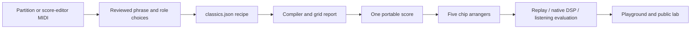

# From a partition to five machines

The three familiar cartridges are **four-bar study arrangements**, not complete
soundtracks, original game audio or bit-perfect recreations. They use one
canonical score on NES, Game Boy, Mega Drive, SNES and C64. Bass and drum parts
are newly arranged for the demo. Credits, source links, excerpt boundaries and
adaptation choices appear in the cartridge UI and the public listening lab.

| Cartridge | Reviewed source | Treatment |
| --- | --- | --- |
| Mario · Ground Theme | [AltoNicoRuso / Alejandro, viola transcription, file 2073](https://ichigos.com/sheets/293) | Opening four bars; melody raised one octave; written rests retained; new accompaniment |
| Zelda · Overworld | [R2XC, clarinet and piano, file 2377](https://ichigos.com/sheets/z) | Main-theme phrase, bars 7–10, concert B-flat; triplet runs explicitly reduced to sixteenth notes |
| Sonic · Green Hill Zone | [NPonline, seventh-chord piano study, file 3093](https://ichigos.com/sheets/712) | Opening four bars; melody lowered one octave; seventh-chord progression retained; new bass/drums |

Original composers: Koji Kondo (Mario/Zelda) and Masato Nakamura (Sonic).
Source PDF SHA-256 values are recorded in `classics.json`. Source PDFs/MIDI files
remain local evaluation inputs; they are not bundled or relicensed as SDK code.
The code license does not transfer ownership of the underlying compositions.

## Reproducible pipeline



1. Identify the composition, transcriber, concert pitch, source checksum and
   a musically useful excerpt. Check the notes against the visible partition.
   A piano reduction or MIDI export is a reference, not an original chip trace.
2. Transcribe the selected melody into `note:quarter-note-beats` tokens. `r`
   means a written rest; fractions such as `1/2` and `1/3` are accepted. Every
   recipe bar is 4/4 and must total exactly four beats. Decide the harmony,
   bass register, articulation and percussion explicitly.
3. Use `exact-sixteenth` unless an adaptation is intended. The compiler rejects
   unsupported rhythms, invalid pitches, collapsed notes and incomplete bars.
   `nearest-sixteenth` opts into rounding cumulative boundaries. Every changed
   boundary is recorded in the generated cartridge. Zelda's maximum boundary
   displacement is 1/12 of a beat; this reduction is disclosed in its UI.
4. Run `pnpm scores:build`. It creates the checked-in
   `apps/web/src/studio/classics.json`, validates all five arrangements and
   records a recipe hash. `pnpm scores:check` checks freshness in CI. No network,
   PDF OCR, Python dependency or audio rendering is needed for this build.
5. Evaluate with the same score, tempo and full-loop duration on all machines:

   ```sh
   node apps/web/scripts/evaluate-audio.mjs \
     --out .artifacts/listening/NEW \
     --baseline .artifacts/listening/PREVIOUS/report.json
   pnpm --filter chipvoice-web publish:lab .artifacts/listening/NEW/report.json
   ```

   A baseline is compared only when score hashes match. New cartridges do not
   pretend to have a previous version. SNES still requires its independent native
   reference; all cases require replay parity, complete loops, stems and clean
   technical results. Public publication requires all six cartridges × five chips.
6. Inspect melody and isolated roles, loop transitions, loudness/peaks and native
   SNES mixer diagnostics. Then exercise the real browser, switch all machines,
   change the composition controls and review mobile/desktop screenshots.
   Numeric passes do not establish musical fidelity or replace listening.

## Optional MIDI extraction

This automates the tedious note/duration entry when the partition editor supplies
MIDI. It does not infer a good arrangement or recognize notes from PDF pixels.

```sh
python3 -m venv .artifacts/score-tools
.artifacts/score-tools/bin/pip install -r scores/requirements.txt
.artifacts/score-tools/bin/python scores/import-midi.py input.mid \
  --track 0 --min-note 79 --transpose -12 --bars 4 > phrase-draft.json
```

The command prints a **review-required draft**, source hash, source tempo,
selected track and timing changes. Select an appropriate melody track/pitch range;
polyphony is rejected rather than resolved by guessing. Cross-bar ties, clipped
excerpt boundaries, tempo changes, non-4/4 meter, pedal and pitch bend require
manual review. Humanized MIDI timing is rejected unless `--snap` is explicit.
Do not use MIDI's file/track title as proof of its identity: the Sonic reference
has a stale internal track title despite its matching notes and PDF.

The Sonic opening was extracted with this command with **zero timing changes**,
then checked against the piano partition. Mario's played MIDI has small timing
and note-length deviations, so its written notation is the rhythm reference.
Zelda's concert pitch and grid reduction were reviewed manually.

[Mido's MIDI timing documentation](https://mido.readthedocs.io/en/stable/files/midi.html)
explains the PPQ and delta-tick interpretation used by the extractor.

## Composition controls

`shapeScore(source, {transpose, drums})` returns ordinary edited score tokens.
Transpose moves melody, bass and chord roots together, preserves chord intervals,
rests and timing, and rejects unsupported pitch shifts. Drum activity (0–100%)
removes hits deterministically, preserving kick/snare and strong beats first.
More activity restores a superset of hits; it never rerolls a random groove.

Always apply a preview to the same source: zero semitones and 100% drums restore
it exactly. The web UI keeps this base per version, groups each slider gesture
into one Undo and restores matching controls through Undo/Redo. Notes themselves
persist, so exports, sharing and recovered drafts contain the audible result.
After reloading or independently editing the notes, those notes are the new base.
Controls lock while recording. Swing and per-role gain remain separate future
work because they need a complete timing/mixing contract across all render paths.
