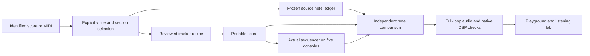

# Source melodies, without invented backing

<p align="center">
  <a href="README.md">English</a> &bull;
  <a href="README_ja.md">日本語</a>
</p>


For **complete multivoice arrangements**, use the additive
[performance workflow](arrangements/README.md) and the public
[/lab/arrangements](https://chipvoice.dev/lab/arrangements) deck. This document
describes the original melody-only tracker cartridges, which remain available
in the composition editor. Their independent melody checks are still valid.

The familiar cartridges are **melody-only transcriptions**. Bass, chords and
drums are silent unless a source part is explicitly transcribed. Choosing a
console changes its instrument, not the notes or the musical form.

| Cartridge | Coverage | Reference | Explicit treatment |
| --- | --- | --- | --- |
| Mario · Ground Theme | 50 bars, 80 seconds | [AltoNicoRuso / Alejandro, viola, file 2073](https://ichigos.com/sheets/293) | Complete melody in the MIDI export; raised one octave; constant 150 BPM replaces expressive tempo automation |
| Zelda · Overworld | 24 bars, about 39 seconds | [Jeffrey M Colletti, dedicated Melody track](https://www.vgmusic.com/file/025afd4ada334a01a042cf6eae931024.html) | Complete melody, including the four-bar introduction and both sections; source pitch and triplets retained |
| Sonic · Green Hill Zone | 24 bars, 38.4 seconds | [Turret 3471, channel transcription](https://www.vgmusic.com/file/02328f72f692b92c7cabfec2d6f661ed.html) | Complete main-theme cycle, source beats 36–132; Lead track 2 until beat 127, returning Synth 2 phrase from track 8; separate intro and second cycle omitted |

Composers: Koji Kondo (Mario/Zelda), Masato Nakamura (Sonic). These are the selected
transcriptions, **not original game captures or claims of perfect game fidelity**.
Sonic is a complete main-theme cycle, not the entire recording. Mario follows the
source export's form; it does not invent missing repeat instructions.

Source MIDI/PDF files stay in local evaluation storage. Their SHA-256 hashes,
track selections, octave shifts and expression events are recorded in the
reference ledgers. The software license does not transfer ownership of the music.

## Why the method changed

The old compiler required one chord root and bass root/fifth per bar, then added
a stock drum pattern. Its four-bar cartridges cut phrases short. Zelda's triplets
were rounded to sixteenths. Exact register replay only proved that the engine
reproduced its own instructions; it could not catch these musical mistakes.

The new compiler has no accompaniment defaults. Its input is an explicit note
and rest timeline. Absent roles are silent. Twelve steps per quarter note retain
both straight rhythms and triplets. Pattern boundaries move to a safe onset or
release so a tie is never cut or retriggered to fit a storage chunk.

## Reproducible workflow



1. **Choose the source and form.** `sources.json` records the track, excerpt,
   destination offset, register and tempo. Prefer a dedicated monophonic melody
   track. Do not select the highest note of a piano reduction and assume it is
   always the melody. Two candidate Zelda reductions were rejected for this
   ambiguity before choosing a separate Melody track.
2. **Freeze independent evidence.** With the source downloaded locally:

   ```sh
   python3 -m venv .artifacts/score-tools
   .artifacts/score-tools/bin/pip install -r scores/requirements.txt
   .artifacts/score-tools/bin/python scores/extract-reference.py \
     zelda .artifacts/score-sources/zelda-colletti.mid > /tmp/zelda-reference.json
   ```

   Review the output before replacing `references/zelda.json`. Raw MIDI onset and
   release positions are retained, with source checksums. Polyphony, clipped
   excerpt edges and unterminated notes fail. Sonic explicitly permits the source's
   one-tick overlap; it disappears when fitted to the notation grid. Controllers
   and tempo events are reported: the ledger represents notes, not a complete
   MIDI performance. Do not silently apply pedal, pitch bend or tempo automation
   when describing notation fidelity.
3. **Review the candidate independently.** `classics.json` uses version 2:
   `beats`, `stepsPerBeat` and `lines`, where each note is
   `[onsetBeat, releaseBeat, "C5"]`. Gaps are rests. Only declared roles sound.
   Chord lines in this melody workflow are single-note voices (`chordShape:[[0]]`);
   a full polyphonic arrangement requires an explicit separate design/review.
   Fit MIDI boundaries to the 1/12-beat grid, preserving every selected pitch.
   Each recipe pins the exact reference-file hash.
4. **Compile and compare.** `pnpm scores:build` writes the browser catalogue;
   `pnpm scores:check` checks it in CI. Neither command rewrites the references.
   The independent checker decodes tracker tokens, aligns note sequences, and
   reports missing/extra notes, wrong pitches, onset/release changes, changed total
   length and invented backing. No octave folding, tempo fitting or time warping
   can make a wrong melody pass. It also observes the real sequencer's note sink
   on all five chip role maps, not just `arrange()`'s return value.
5. **Compare an iteration** saved as a score JSON:

   ```sh
   pnpm scores:compare zelda path/to/candidate-score.json
   ```

   Output is a detailed JSON diff; errors return a nonzero exit status. Timings are
   absolute beats, with at most **1/24 beat per onset/release** for MIDI rounding.
   Pitches, count, form and backing have no tolerance. Current maximum onset /
   release deviations: Mario 0.0333 / 0.0365 beat; Zelda 0 / 0.0313; Sonic 0.0105 /
   0.0105. In particular, Zelda's triplet onsets have zero displacement.
6. **Evaluate actual audio**, sequentially on a busy machine:

   ```sh
   node apps/web/scripts/evaluate-audio.mjs \
     --out .artifacts/listening/NEW \
     --baseline .artifacts/listening/PREVIOUS/report.json
   pnpm --filter chipvoice-web publish:lab .artifacts/listening/NEW/report.json
   ```

   Default captures cover a full loop, up to 180 seconds. Explicit shorter
   captures remain marked incomplete and cannot be published. Changed scores
   skip the old-score baseline; they are not presented as engine-only comparisons.
   Offline render and register capture start music at time zero: the former
   100 ms live-start delay truncated the end of full-loop files. Publication needs
   all 30 cases, stems, source comparisons, complete loops, replay parity, clean
   signal diagnostics and native SNES comparisons.
7. **Listen and inspect.** Play the complete phrase, listen to its ending and
   loop seam, compare isolated melody and source notation, and test actual browser
   controls on desktop/mobile. A note-sink pass proves pitches and scheduling
   before the driver/DSP, not the acoustic pitch/timbre after them. Native SNES
   parity verifies our renderer against the native DSP, not against game music.

Mutation tests deliberately remove/add a note, change an octave, shift an onset,
erase a rest, change the total length and add a bass. Each must fail. Separate
regressions exercise triplet playback, eighth-note pad quantization, held notes
across storage boundaries, final-note audio, and grid preservation through storage, forks and public audio. An additive database
migration gives existing songs a default grid of four; no existing notes change.

## Playback and editing

- Tempo, transpose and console edits retain the musical phase. Loading a different
  form starts at its beginning through the same continuous crossfade.
- Drum activity is disabled when the score has no drums. Deliberately choosing
  “Vary drums” is a creative edit; it is not part of the source transcription.
- The source-check label changes to “Edited version” when notes/order/grid change.
  It never certifies a modified score based only on its cartridge title.
- Notes, order and `stepsPerBeat` survive drafts, shares, forks, recording and
  exports. Undo/Reset keep the existing composition-control behavior.
- For a complete long theme, download a single WAV from the playground or use
  the SDK locally (the default export plays two loops, capped at 300 seconds).
  Public API audio excerpts accept `?seconds=1..30`; multi-file export bundles
  also retain their 30-second bound. Neither limit shortens the playable score
  or the full-loop recordings published in the listening lab.
  Published audio links and social audio metadata explicitly request a 30-second
  preview for longer scores, while their share page plays the full score.

The older `import-midi.py` remains a small strict sixteenth-grid draft helper.
For these longer source comparisons, use `extract-reference.py` and the frozen
ledgers instead. Neither tool is PDF OCR or an automatic musical arranger.
