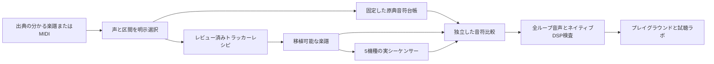

<a id="source-melodies-without-invented-backing"></a>
# 伴奏を創作しない原典旋律

<p align="center">
  <a href="README.md">English</a> &bull;
  <a href="README_ja.md">日本語</a>
</p>


**完全な多声編曲**には、追加した[演奏ワークフロー](arrangements/README_ja.md)と公開[/lab/arrangements](https://chipvoice.dev/lab/arrangements)デッキを使います。この文書は、作曲エディターに残る初期の旋律専用トラッカーカートリッジを説明します。独立した旋律検査は引き続き有効です。

親しみのあるカートリッジは**旋律だけの採譜**です。原典パートを明示的に採譜しない限り、ベース、和音、ドラムは無音です。機種選択で変わるのは楽器であって、音符や曲の形式ではありません。

| カートリッジ | 範囲 | 参照 | 明示的な扱い |
| --- | --- | --- | --- |
| Mario · Ground Theme | 50小節、80秒 | [AltoNicoRuso / Alejandro、ヴィオラ、ファイル2073](https://ichigos.com/sheets/293) | MIDI出力の全旋律。1オクターブ上げ、表情のテンポ自動化を固定150 BPMへ置換 |
| Zelda · Overworld | 24小節、約39秒 | [Jeffrey M Colletti、専用Melodyトラック](https://www.vgmusic.com/file/025afd4ada334a01a042cf6eae931024.html) | 4小節の導入と両セクションを含む全旋律。原音高と3連符を保持 |
| Sonic · Green Hill Zone | 24小節、38.4秒 | [Turret 3471、チャンネル採譜](https://www.vgmusic.com/file/02328f72f692b92c7cabfec2d6f661ed.html) | 原典36〜132拍の主題1周期。127拍までLeadのトラック2、回帰はトラック8のSynth 2。別イントロと第2周期は省略 |

作曲者は近藤浩治（Mario／Zelda）、中村正人（Sonic）。選んだ採譜であり、**元ゲームの取得や完全なゲーム忠実度の主張ではありません**。Sonicは主題の1周期で、録音全体ではありません。Marioは原典出力の形式に従い、欠けた反復指示を創作しません。

原MIDI／PDFはローカル評価領域に置きます。SHA-256、選択トラック、オクターブ移動、表情イベントを参照台帳へ記録します。ソフトウェアのライセンスで音楽の所有権は移りません。

<a id="why-the-method-changed"></a>
## 方法を変えた理由

旧コンパイラーは毎小節の和音ルートとベースのルート／5度を要求し、定型ドラムを足しました。4小節のカートリッジはフレーズを途中で切り、Zeldaの3連符は16分音符へ丸めていました。正確なレジスター再生で分かるのは自分の命令を再現することだけで、これらの音楽上の誤りは捕らえられませんでした。

新コンパイラーに既定伴奏はありません。音符と休符の明示的なタイムラインを受け、ない役割は無音にします。4分音符12ステップで通常リズムと3連符を保持します。パターン境界を安全な開始／解放へ移し、保存単位へ収めるためにタイを切ったり再発音したりしません。

<a id="reproducible-workflow"></a>
## 再現可能な手順



1. **原典と形式を選ぶ。** `sources.json`にトラック、抜粋、出力先オフセット、音域、テンポを記録します。専用の単旋律トラックを優先し、ピアノ縮約の最高音が常に旋律だと仮定しません。Zeldaではこの曖昧さで2候補を却下してから専用Melodyを選びました。
2. **独立した証拠を固定する。** 原典をローカルへ取得して実行します。

   ```sh
   python3 -m venv .artifacts/score-tools
   .artifacts/score-tools/bin/pip install -r scores/requirements.txt
   .artifacts/score-tools/bin/python scores/extract-reference.py \
     zelda .artifacts/score-sources/zelda-colletti.mid > /tmp/zelda-reference.json
   ```

   `references/zelda.json`を置換する前に出力をレビューします。生MIDIの開始／解放位置とチェックサムを保持します。多声、抜粋端の切断、未終了音は失敗にします。Sonicは原典の1tick重複を明示的に許し、記譜グリッドへ合わせると消えます。コントローラーとテンポを報告し、台帳は全MIDI演奏でなく音符を表します。記譜忠実度を説明するとき、ペダル、ベンド、テンポ自動化を黙って適用しません。
3. **候補を独立にレビューする。** `classics.json`の版2は`beats`、`stepsPerBeat`、`lines`を使い、音は`[onsetBeat, releaseBeat, "C5"]`です。隙間は休符で、宣言した役割だけが鳴ります。この旋律手順の和音行は単声（`chordShape:[[0]]`）です。完全な多声編曲は別の明示設計／レビューが必要です。選んだ全音高を保って境界を1/12拍へ合わせ、各レシピで参照ファイルの正確なハッシュを固定します。
4. **コンパイルと比較。** `pnpm scores:build`がブラウザーカタログを書き、`pnpm scores:check`がCIで検査します。参照は書き換えません。独立検査器がトークンを解読して音列を整列し、欠落／余分、音高、開始／解放、全長、創作伴奏の差を報告します。オクターブ折り畳み、テンポ調整、時間伸縮で誤旋律を通しません。`arrange()`の戻り値だけでなく、5チップの役割マップ上で実シーケンサーのnote sinkも観測します。
5. 楽譜JSONに保存した**改訂を比較**します。

   ```sh
   pnpm scores:compare zelda path/to/candidate-score.json
   ```

   詳細なJSON差分を出し、誤りは非0終了します。時刻は絶対拍で、MIDI丸めの許容差は**各開始／解放で最大1/24拍**。音高、数、形式、伴奏には許容差なし。現在の最大開始／解放差はMario 0.0333／0.0365拍、Zelda 0／0.0313、Sonic 0.0105／0.0105。特にZeldaの3連符開始は変位0です。
6. 混雑した機械では順番に**実音声を評価**します。

   ```sh
   node apps/web/scripts/evaluate-audio.mjs \
     --out .artifacts/listening/NEW \
     --baseline .artifacts/listening/PREVIOUS/report.json
   pnpm --filter chipvoice-web publish:lab .artifacts/listening/NEW/report.json
   ```

   既定は最大180秒の全ループ。明示的な短い取得は不完全と記し、公開できません。楽譜変更は旧楽譜基準を飛ばし、エンジンだけの比較とは表示しません。オフラインとレジスター取得は時刻0から始めます。従来のライブ用100 ms遅延では全ループファイルの末尾が欠けました。公開には30ケース全部、ステム、原典比較、全ループ、取得一致、正常な信号診断、ネイティブSNES比較が必要です。
7. **試聴と確認。** フレーズ全体、終止、ループ継ぎ目を聞き、分離旋律と原典楽譜を比較し、PC／モバイルの実ブラウザー操作を試します。note sink合格はドライバー／DSP前の音高と予約を証明するもので、後段の音響的な音高／音色ではありません。ネイティブSNES一致もネイティブDSPとの検証で、ゲーム音楽との比較ではありません。

改変テストでは音の削除／追加、オクターブ変更、開始移動、休符削除、全長変更、ベース追加を行い、すべて失敗する必要があります。別の回帰で3連符再生、8分音符パッド量子化、保存境界をまたぐ保持音、最後の音声、保存・フォーク・公開音声のグリッド保持を検査します。追加型DB移行で既存曲のグリッドを4にし、既存音符は変更しません。

<a id="playback-and-editing"></a>
## 再生と編集

- テンポ、移調、機種変更は楽曲位相を保ちます。別形式の読込は同じ連続クロスフェードで冒頭へ移ります。
- ドラムなしの楽譜では活動量を無効にします。「Vary drums」を意図的に選ぶのは創作編集で、原典採譜の一部ではありません。
- 音符／order／gridが変わると原典検査ラベルを「Edited version」にします。カートリッジ名だけで改訂楽譜を認証しません。
- 音符、order、`stepsPerBeat`を下書き、共有、フォーク、録音、出力で保ちます。Undo／Resetは既存の作曲操作と同じです。
- 長いテーマ全体はプレイグラウンドから単一WAVを取得するかローカルSDKを使います。既定出力は2ループ、上限300秒。公開APIの抜粋は`?seconds=1..30`、複数ファイル束も30秒が上限ですが、再生できる楽譜やラボの全ループ録音を短くしません。長い曲の公開音声リンクとソーシャル音声メタデータは明示的に30秒プレビューを要求し、共有ページは全曲を鳴らします。

旧`import-midi.py`は厳密な16分グリッドの小さな下書き補助として残します。長い原典比較には`extract-reference.py`と固定台帳を使います。どちらもPDF OCRや自動編曲器ではありません。
